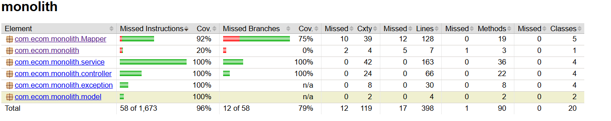

# E-Commerce Monolith

Focus areas: **unit tests**, **integration tests** with **Testcontainers**, and **coverage gates**.

---

## Stack

- Java 21, Spring Boot 3
- Spring MVC, Spring Data JPA, Bean Validation
- PostgreSQL (**Testcontainers** for integration tests), H2 (fast unit/slice tests)
- JUnit 5, MockMvc, AssertJ, Mockito
- Maven Surefire/Failsafe, JaCoCo (coverage)

---

## How to run tests

> Prereqs: Java 21, Docker (for integration tests), Maven.

**Fast loop (unit & slice tests only):**
```bash
mvn test
```

**Full suite (unit + integration + coverage gate):**
```bash
mvn verify
```

**Open the coverage report:**
- HTML: `target/site/jacoco/index.html`
- XML (for tools): `target/site/jacoco/jacoco.xml`

**Where reports live:**
- Unit test reports → `target/surefire-reports/`
- Integration test reports → `target/failsafe-reports/`
- Coverage (HTML/XML) → `target/site/jacoco/`

---

## Testing strategy (what & why)

### 1) Unit & slice tests (fast)
- Run by **Surefire** using file patterns: `*Test`, `*Tests`, `*TestCase`.
- H2 in-memory where appropriate for quick feedback.

### 2) Integration tests (real wiring)
- Run by **Failsafe** using file pattern: `*IT`.
- Boot the full Spring context and exercise controllers with **MockMvc**.
- Use **Testcontainers** PostgreSQL to hit a real database (no H2 quirks).
- Shared `BaseIntegrationTest`:
  - Starts a `postgres:15-alpine` container.
  - Uses `@DynamicPropertySource` to inject JDBC URL/username/password/driver/dialect at test time.
  - Sets `ddl-auto=create-drop` for deterministic schema in tests.
  - Uses `@DirtiesContext(AFTER_CLASS)` so each IT class gets a fresh Spring context (prevents stale JDBC ports when containers restart per class).

**Covered flows**
- **ProductApiIT** — create → list → search → fetch by id (+ validation error)
- **UserApiIT** — create → list → get → update (+ validation error)
- **CartApiIT** — `X-User-ID` header handling, add/list/remove (+ error paths)
- **OrderApiIT** — user + products → add to cart → place order (201) → cart clears (+ empty cart 404)

All of the above are true end-to-end controller → service → repository → DB checks with real JSON marshalling and global exception handling.

---

## Coverage & quality gates

## Test Coverage (screenshot)

<!-- Save your screenshot (from target/site/jacoco/index.html) as docs/coverage-report.png -->


- Combined **unit + integration** coverage measured by JaCoCo with an **85% line** quality gate; current run shows ~**96% line** / **79% branch** coverage.
- Reproduce locally with `mvn verify`, then open `target/site/jacoco/index.html` (this screenshot reflects that HTML report).

> Adjust thresholds/excludes under `jacoco-maven-plugin` → `check` execution in `pom.xml`.

---

## Local tips

- First integration run will pull the Postgres image; subsequent runs are faster.
- If Docker isn’t available and you still want to run the full build:
```bash
mvn verify -DskipITs
```
- In IDEs, you can run `*IT` classes directly; Testcontainers starts automatically.

---

## Quick start

```bash
# run everything locally
mvn verify

# open the coverage report
# macOS:
open target/site/jacoco/index.html
# Linux:
xdg-open target/site/jacoco/index.html
# Windows (PowerShell):
start target/site/jacoco/index.html
```
